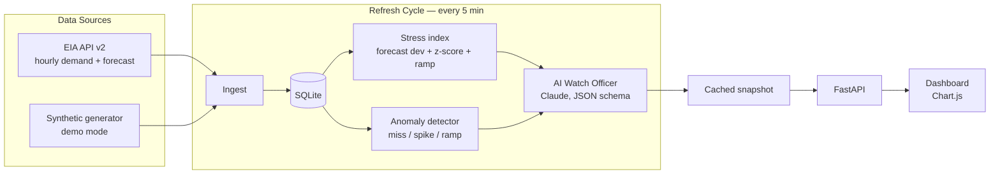

# The Golden Sentry

**Real-time grid situational awareness with an AI watch officer.**

The Golden Sentry fuses live hourly electricity demand data from four US grid operators (ERCOT, CAISO, PJM, NYISO) into a single operational picture: a composite stress index per region, statistical anomaly detection, and — the core of the project — an AI reasoning layer that reads the raw signals every cycle and writes the kind of brief a control-room watch officer would: current state, what's abnormal, recommended posture.

It is a small-scale version of the data-fusion → operational-decision loop that platforms like Palantir Foundry and Anduril Lattice are built around, applied to the energy × compute domain (grid stress in the regions absorbing AI datacenter load growth).


## What it does

Every refresh cycle (default: 5 minutes):

1. **Ingest** — pulls 72h of hourly demand + day-ahead forecast per region from the EIA API v2 (`electricity/rto/region-data`). With no API key, a deterministic synthetic generator produces realistic diurnal demand curves with injected stress events, so the full pipeline runs out of the box.
2. **Persist** — observations land in SQLite keyed on `(region, hour)`, so re-ingestion is idempotent and history survives restarts.
3. **Analyze** — two independent layers:
   - **Stress index (0–100)** per region: weighted blend of forecast deviation (50%), rolling 24h demand z-score (30%), and hour-over-hour ramp rate (20%), mapped to watch levels `NORMAL / ELEVATED / HIGH / CRITICAL`.
   - **Anomaly detection** across the whole series: forecast misses (>6%), demand spikes (|z| > 3), and fast ramps (>10%/h), each with warning/critical severity.
4. **Brief** — the full snapshot (metrics + anomalies) goes to Claude (`claude-opus-4-8`) with a watch-officer system prompt and a strict JSON schema. The response is a structured judgment: overall watch level, headline, 3–4 sentence assessment, regions of concern. No key or an API failure? A rule-based fallback brief is generated from the same signals — the dashboard is never blank.
5. **Serve** — FastAPI caches the snapshot; the dashboard (vanilla JS + Chart.js, no build step) polls it and renders the brief, region stress cards, a demand-vs-forecast chart, and the anomaly log.

## Architecture



```
goldensentry/
├── config.py              # env-driven config, region registry
├── models.py              # Observation dataclass
├── data/
│   ├── eia_client.py      # EIA API v2 client (live mode)
│   ├── synthetic.py       # deterministic demo-mode generator
│   └── store.py           # SQLite persistence (stdlib sqlite3)
├── analysis/
│   ├── stress.py          # composite stress index + watch levels
│   └── anomaly.py         # rolling z-score / forecast-miss / ramp detectors
├── briefing/
│   └── watch_officer.py   # Claude brief w/ JSON schema + rule-based fallback
├── service.py             # orchestrator: ingest → analyze → brief → cache
└── api.py                 # FastAPI app, background refresh loop, static UI
```

## Quickstart

```bash
pip install -r requirements.txt
python run.py
# → http://localhost:8000  (demo mode, no keys needed)
```

**Live grid data** — get a free EIA key at <https://www.eia.gov/opendata/register.php>, then:

```bash
cp .env.example .env    # set EIA_API_KEY=...
python run.py           # header badge switches to LIVE — EIA DATA
```

**AI watch officer** — set `ANTHROPIC_API_KEY` in `.env`. Without it the brief is generated by a deterministic rule-based fallback (labelled in the UI).

## API

| Endpoint | Description |
|---|---|
| `GET /api/status` | Full snapshot: brief, per-region metrics, 24h anomaly log |
| `GET /api/regions/{code}/series` | 72h demand vs forecast for one region (`TEX`, `CAL`, `MIDA`, `NY`) |
| `POST /api/refresh` | Force an immediate ingest → analyze → brief cycle |

## Tests

```bash
pytest
```

Covers the stress index (bounds, monotonicity, graceful degradation on missing signals), the anomaly detectors (catches injected events, silent on clean data, severity escalation), and the synthetic source (determinism, plausibility, guaranteed stress events).

## Design decisions

- **Demo mode is a first-class citizen.** The synthetic generator is deterministic per `(region, hour)`, so successive refreshes extend the series smoothly instead of rewriting history — the same property the real feed has. Anyone can clone and run the full pipeline in under a minute with zero credentials.
- **The AI layer is constrained, not freeform.** The watch officer gets a strict JSON schema (`output_config.format`) and a system prompt that forbids inventing numbers. The structured output feeds the UI directly — no fragile text parsing.
- **Fallbacks everywhere.** No EIA key → synthetic data. No Anthropic key or API error → rule-based brief computed from the same signals. The dashboard degrades, never breaks.
- **Boring persistence on purpose.** stdlib `sqlite3` with `INSERT OR REPLACE` keyed on `(region, hour)` — idempotent ingestion with zero infrastructure.
- **No frontend build step.** Vanilla JS + Chart.js from a CDN keeps the surface area small and the clone-to-running time short.

## Data source

Hourly demand and day-ahead forecast from the [EIA Hourly Electric Grid Monitor](https://www.eia.gov/electricity/gridmonitor/) (`/v2/electricity/rto/region-data`), respondents `TEX`, `CAL`, `MIDA`, `NY`, series types `D` (demand) and `DF` (day-ahead forecast).
